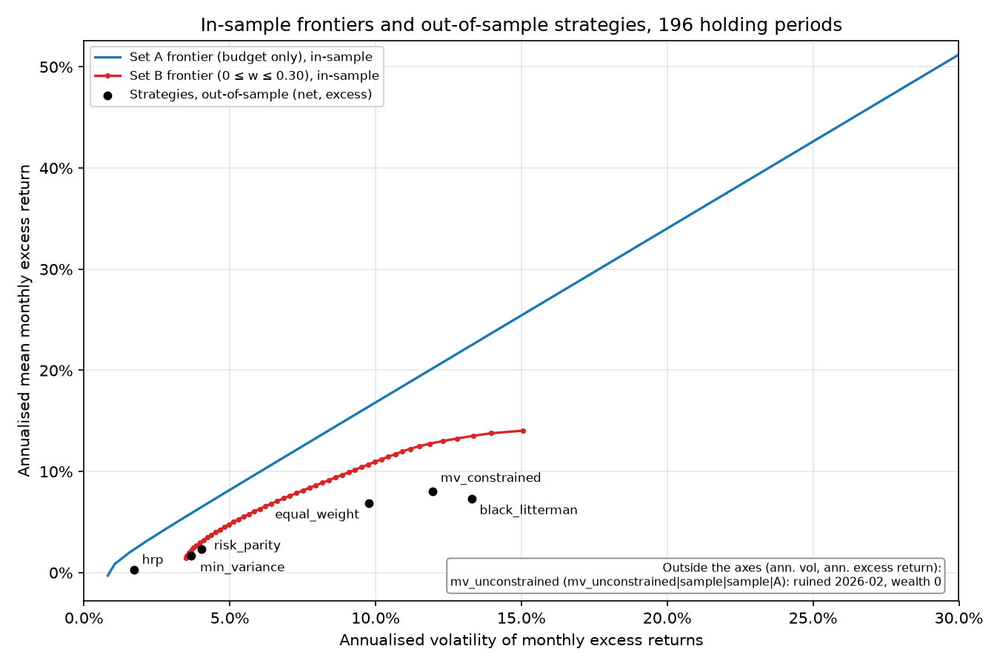
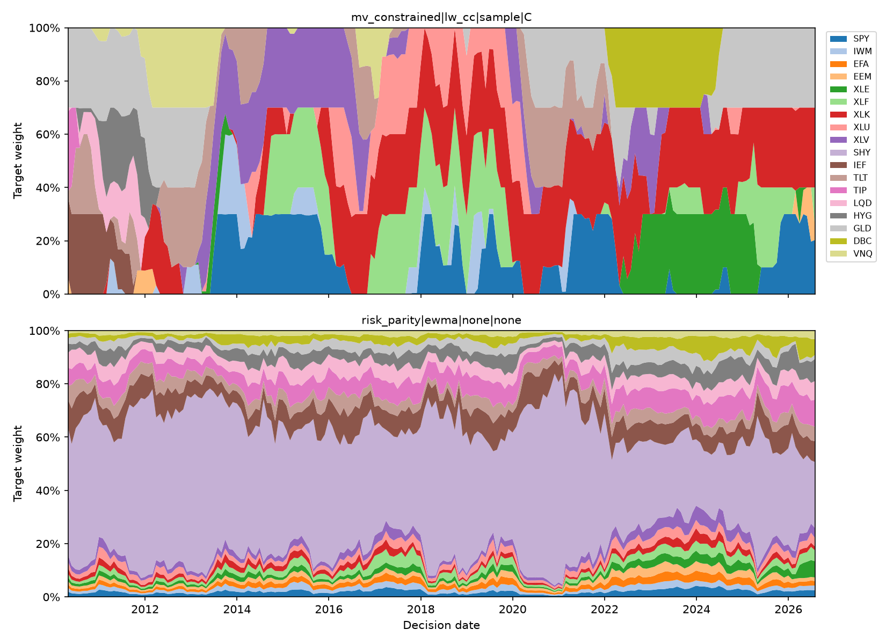
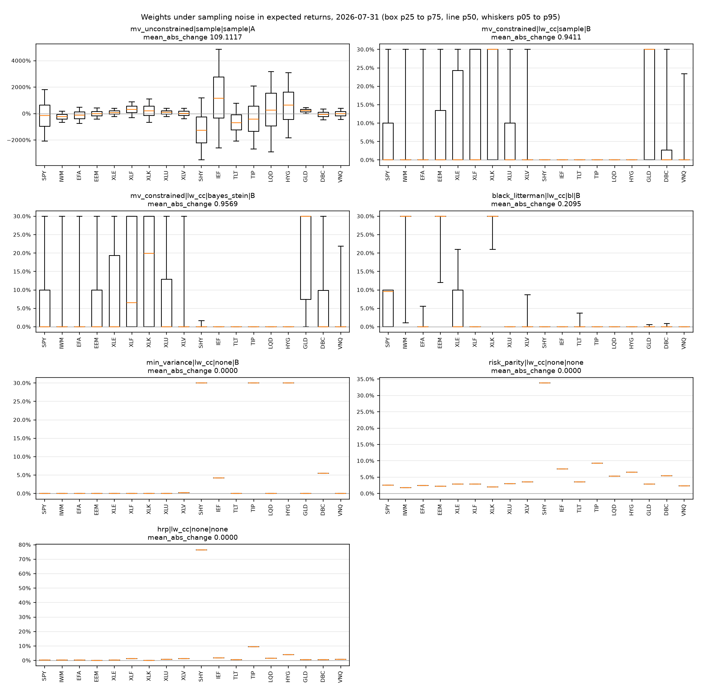
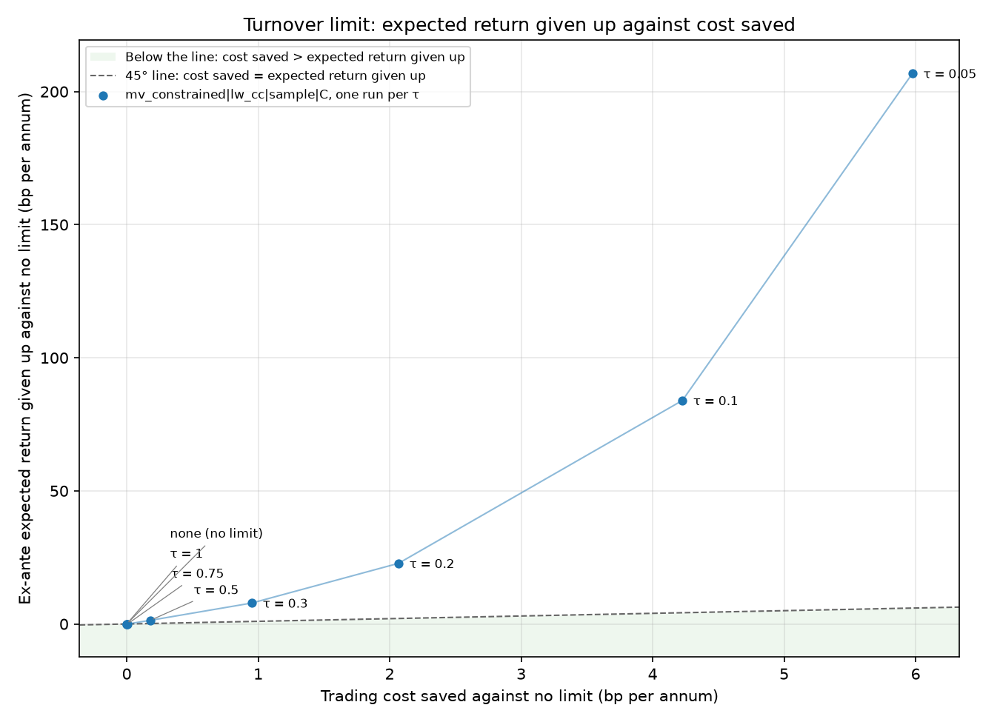

# Constrained Portfolio Optimiser and Trade Generator

[](https://github.com/uty101/Constrained-Portfolio-Optimiser/actions/workflows/tests.yml)

This repo runs 6 allocators and an equal-weight benchmark through a walk-forward backtest on 18 US-listed multi-asset ETFs, with trading costs, a turnover limit and position caps, and asks how much of their in-sample advantage is left once estimation error has had its say.
It also ships `pctrade`, a command-line tool that turns a positions file and any of the long-only strategies into a lot-rounded trade list for the fund.

The headline table is under [Results](#results), the 4 charts sit next to the findings they support, and every table, chart and backtest file is committed in [`outputs/`](outputs/), so nothing needs to be run to see the results.

## What it found

**Question 1: how much of the in-sample gap survives out of sample?** Capped mean-variance kept 61% of the long-only frontier's Sharpe ratio and 39% of the unconstrained frontier's. In sample, the budget-only frontier offers a maximum Sharpe ratio of 1.72 (a supremum the frontier approaches but never reaches) and the long-only frontier capped at 30% per asset offers 1.10. Out of sample, `mv_constrained|lw_cc|sample|C` earned a Sharpe of 0.67 (90% interval 0.36 to 1.03), equal weight 0.71 (0.39 to 1.11) and `min_variance|lw_cc|none|B` 0.45 (−0.003 to 1.01). No allocator beat equal weight by a margin the bootstrap can tell apart from 0. HRP, under all 4 covariance estimators, is the only allocator whose Sharpe is reliably below equal weight's: on the primary row, `hrp|sample|none|none` trails it by 0.55 with a 90% interval of −1.02 to −0.01. 3 of the 4 unconstrained mean-variance funds went to 0, and the 4th, on the Ledoit-Wolf covariance, was not ruined but lost 98% from peak to trough.

**Question 2: what does a turnover limit cost and save?** At the default limit of τ = 0.30, the fund gives up 7.9 bp a year of ex-ante expected return to save 0.95 bp a year of trading cost. Each limit that binds gives up more expected return than it saves in cost, so no limit in the grid lies below the 45° line. After the fact, the realised effect cannot be told apart from 0: τ = 0.30 returned −7.8 bp a year against no limit (90% interval −41.8 to 24.9), and even the tightest limit, τ = 0.05, returned 125.9 bp a year with an interval of −87.7 to 332.7.

**Question 3: how sensitive are mean-variance weights to noise in expected returns?** Extremely, until a constraint steps in. Perturbing the means by their own sampling error at 2026-07-31 moved the unconstrained weights by a mean absolute change of 109.1 (10,911% of the fund), against 0.94 for the long-only capped version. Bayes-Stein shrinkage of the mean does not steady the weights: its mean absolute change divided by that of the plain capped fund is 0.98 at 2012-12-31, 0.95 at 2020-02-28 and 1.02 at 2026-07-31. Black-Litterman steadies them at 2 of the 3 dates, with ratios of 0.50 and 0.22, but not at 2012-12-31, where its ratio is 1.31.

**Question 4: which covariance estimator forecasts risk best?** It depends on the portfolio. For equal weight, EWMA beats Ledoit-Wolf constant correlation: its QLIKE difference is −0.24 (90% interval −0.58 to −0.005), and lower is better. For the global minimum variance portfolio, the one an optimiser builds, EWMA scores 0.45 worse, though that interval (−0.07 to 1.24) includes 0. The clearer signal is the bias: EWMA under-forecasts that portfolio's risk with a bias ratio of 1.38, outside the 0.92 to 1.08 band for a calibrated forecast, against 1.01 for Ledoit-Wolf.

## Setup

The fund holds 18 ETFs: US equity (SPY, IWM), international equity (EFA, EEM), 5 US sectors (XLE, XLF, XLK, XLU, XLV), Treasuries (SHY, IEF, TLT), TIPS (TIP), credit (LQD, HYG) and real assets (GLD, DBC, VNQ). Prices are yfinance adjusted closes from 2007-04-11 to 2026-09-15, and the risk-free rate is the FRED 3-month Treasury yield.

At each month end from 2010-04-30 to 2026-07-31, every strategy estimates on the trailing 36 months and the fund trades at the next day's close. That gives 196 holding periods. Turnover and cost are measured against the drifted weights. Costs are 3 bp one way for the liquid ETFs and 6 bp for EEM, TIP, HYG, DBC and VNQ.

The 7 primary strategies are unconstrained mean-variance (set A: budget only, shorts allowed), capped mean-variance and Black-Litterman (set C: long only, at most 30% per asset, turnover at most 0.30 a month, costs in the objective), minimum variance (set B: long only, at most 30%), risk parity and HRP (long only, uncapped), and equal weight. The maths is in [docs/METHODS.md](docs/METHODS.md).

## Results

The primary table sets each strategy's Sharpe interval next to its risk, drawdown and trading. Read the intervals before the point estimates: most of them overlap equal weight's, and the ruined row shows the month the fund lost everything.

<!-- readme_primary.md -->
| Strategy | Ann. return | Vol | Sharpe (90% interval) | Max DD | Monthly turnover | Avg positions |
|---|---:|---:|---:|---:|---:|---:|
| `mv_unconstrained\|sample\|sample\|A` | −100.0% | 109.0% | ruined (2026-02) | −100.0% | 2907.8% | 18.0 |
| `mv_constrained\|lw_cc\|sample\|C` | 9.3% | 12.0% | 0.67 (0.36 to 1.03) | −17.3% | 17.7% | 4.6 |
| `min_variance\|lw_cc\|none\|B` | 3.2% | 3.6% | 0.45 (0.00 to 1.01) | −10.7% | 3.3% | 6.6 |
| `risk_parity\|ewma\|none\|none` | 3.8% | 4.1% | 0.57 (0.17 to 1.09) | −10.4% | 12.0% | 17.9 |
| `black_litterman\|lw_cc\|bl\|C` | 8.3% | 13.3% | 0.55 (0.26 to 0.85) | −21.6% | 23.2% | 5.6 |
| `hrp\|sample\|none\|none` | 1.8% | 1.8% | 0.16 (−0.31 to 0.73) | −6.3% | 2.1% | 6.8 |
| `equal_weight\|none\|none\|none` | 8.3% | 9.8% | 0.71 (0.39 to 1.11) | −17.3% | 2.7% | 18.0 |
<!-- /readme_primary.md -->

Chart 1 puts the in-sample frontiers next to what each strategy actually delivered. The vertical gap between the lines and the dots is what was on offer in sample and not delivered. Every dot lands below the blue line, and none of the capped strategies reaches the red one.



Chart 2 shows why capped mean-variance and risk parity feel so different to run. The top panel swings between corner portfolios as the 36-month means shift, while the bottom panel barely moves and keeps its largest slice in short Treasuries.



## Estimation error and weight stability

Chart 3 redraws the weights at 2026-07-31 under 1,000 perturbations of the expected returns. Compare the y-axes first: the unconstrained panel is measured in thousands of percent, the capped panels in tens. The 3 risk-based allocators do not read expected returns at all, so their boxes collapse to lines.



The ratios of mean absolute change against the capped mean-variance fund on the same draws, at all 3 dates:

- 2012-12-31: Bayes-Stein 0.98, Black-Litterman 1.31
- 2020-02-28: Bayes-Stein 0.95, Black-Litterman 0.50
- 2026-07-31: Bayes-Stein 1.02, Black-Litterman 0.22

Bayes-Stein's ratios sit within a few percent of 1 at every date, so shrinking the mean leaves the weights about as noisy as before. Black-Litterman's ratios run from above 1 to well below it, so how much it steadies the weights depends on the date.

## Turnover limits

Chart 4 plots, for each turnover limit, the expected return given up against the trading cost saved. A limit pays for itself ex ante only below the dashed 45° line. Every limit that binds sits above it, and the tighter the limit the further above it climbs.



The table adds the realised side. Look at the last column: the intervals are wide and every one of them straddles 0, so the backtest cannot say whether any limit helped after costs.

<!-- readme_turnover.md -->
| τ | Months binding | Return given up (bp pa) | Cost saved (bp pa) | Realised net vs no limit (bp pa, 90% interval) |
|---|---:|---:|---:|---:|
| 0.05 | 194 | 206.8 | 6.0 | 125.9 (−87.7 to 332.7) |
| 0.1 | 176 | 84.0 | 4.2 | 33.9 (−101.9 to 164.4) |
| 0.2 | 116 | 22.8 | 2.1 | −23.5 (−81.0 to 28.9) |
| 0.3 | 62 | 7.9 | 1.0 | −7.8 (−41.8 to 24.9) |
| 0.5 | 19 | 1.4 | 0.2 | −3.4 (−12.8 to 5.0) |
| 0.75 | 1 | 0.0 | 0.0 | 0.8 (0.0 to 2.5) |
| 1.0 | 0 | 0.0 | 0.0 | 0.0 (0.0 to 0.0) |
<!-- /readme_turnover.md -->

## Risk forecasts

The table scores each covariance estimator on 3 sets of portfolios held over each month. Lower QLIKE is better, and a bias ratio above the band means risk was under-forecast. Watch the GMV columns: that portfolio is built from the estimate it is scored on, so it exposes optimiser bias that the equal-weight and random portfolios hide.

<!-- readme_qlike.md -->
| Estimator | EW QLIKE | EW diff vs lw_cc (90% interval) | EW bias ratio | GMV QLIKE | GMV diff vs lw_cc (90% interval) | GMV bias ratio | random QLIKE | random diff vs lw_cc (90% interval) | random bias ratio |
|---|---:|---:|---:|---:|---:|---:|---:|---:|---:|
| sample | −5.855 | 0.000 (−0.006 to 0.003) | 0.96 | −10.942 | −0.041 (−0.085 to 0.006) | 1.05 | −5.843 | 0.000 (−0.004 to 0.002) | 0.96 |
| lw_cc | −5.854 | reference | 0.97 | −10.902 | reference | 1.01 | −5.843 | reference | 0.97 |
| ewma | −6.094 | −0.239 (−0.576 to −0.005) | 1.04 | −10.452 | 0.450 (−0.068 to 1.240) | 1.38 | −6.063 | −0.220 (−0.520 to −0.009) | 1.04 |
| pca3 | −5.862 | −0.008 (−0.039 to 0.012) | 0.95 | −10.537 | 0.365 (0.267 to 0.476) | 1.15 | −5.849 | −0.006 (−0.032 to 0.010) | 0.95 |

Bias ratio 90% band for a correct forecast over 196 months: 0.92 to 1.08. A QLIKE difference below 0 means a better forecast than lw_cc.
<!-- /readme_qlike.md -->

## Checks on the assumptions

Scaling every cost by 0 and by 3 tells us whether the ranking depends on the cost model. In the first table below, look for any change in the order of the Sharpe columns: there is none.

Estimating the covariance from 36 monthly returns instead of daily ones puts 18 assets against 36 observations. The second table compares the 2 strategies most exposed to that. Unconstrained mean-variance blows up far sooner on the monthly estimate. Capped minimum variance keeps a similar Sharpe ratio but trades about twice as much.

<!-- readme_robustness.md -->
**Cost scales.** Every one-way cost multiplied by the scale.

| Strategy | Sharpe, costs × 0 | Sharpe, costs × 1 | Sharpe, costs × 3 |
|---|---:|---:|---:|
| `mv_unconstrained\|sample\|sample\|A` | ruined | ruined | ruined |
| `mv_constrained\|lw_cc\|sample\|C` | 0.68 | 0.67 | 0.67 |
| `min_variance\|lw_cc\|none\|B` | 0.46 | 0.45 | 0.44 |
| `risk_parity\|ewma\|none\|none` | 0.58 | 0.57 | 0.54 |
| `black_litterman\|lw_cc\|bl\|C` | 0.55 | 0.55 | 0.53 |
| `hrp\|sample\|none\|none` | 0.16 | 0.16 | 0.15 |
| `equal_weight\|none\|none\|none` | 0.71 | 0.71 | 0.70 |

**Covariance from 36 monthly returns** against the daily estimate.

| Σ from | Strategy | Months | Ann. return | Vol | Sharpe | Max DD | Monthly turnover |
|---|---|---:|---:|---:|---:|---:|---:|
| daily | `mv_unconstrained\|sample\|sample\|A` | 191 | −100.0% | 109.0% | ruined (2026-02) | −100.0% | 2907.8% |
| monthly | `mv_unconstrained\|sample\|sample\|A` | 9 | −100.0% | 203.8% | ruined (2010-12) | −100.0% | 41966.1% |
| daily | `min_variance\|sample\|none\|B` | 196 | 3.2% | 3.6% | 0.46 | −10.6% | 3.4% |
| monthly | `min_variance\|sample\|none\|B` | 196 | 3.5% | 3.6% | 0.54 | −9.7% | 6.6% |
<!-- /readme_robustness.md -->

The risk-based funds run at a fraction of equal weight's volatility, so their unlevered returns mostly measure that gap. The table scales each one by k each month to equal weight's forecast vol, with cash at the risk-free rate and a 50 bp a year financing spread on borrowing. Risk parity levered to equal weight's vol keeps a Sharpe within noise of equal weight's. HRP levered to the same vol does not, because scaling up a fund that is mostly short Treasuries scales up a return that barely beat cash.

<!-- readme_levered.md -->
| Strategy | Mean k | Max k | Ann. return | Vol | Sharpe (90% interval) | Sharpe minus equal weight (90% interval) | Max DD |
|---|---:|---:|---:|---:|---:|---:|---:|
| `risk_parity\|lw_cc\|none\|none` | 3.05 | 5.19 | 8.2% | 11.0% | 0.63 (0.17 to 1.15) | −0.08 (−0.41 to 0.28) | −31.3% |
| `min_variance\|lw_cc\|none\|B` | 3.21 | 4.32 | 6.2% | 12.2% | 0.42 (−0.06 to 1.00) | −0.28 (−0.71 to 0.20) | −40.6% |
| `hrp\|lw_cc\|none\|none` | 7.97 | 16.53 | −1.1% | 12.3% | −0.15 (−0.63 to 0.45) | −0.86 (−1.35 to −0.29) | −61.5% |
| `equal_weight\|none\|none\|none` | 1.00 | 1.00 | 8.3% | 9.8% | 0.71 (0.39 to 1.11) | benchmark | −17.3% |
<!-- /readme_levered.md -->

HRP's weak Sharpe follows from where it put the money: across the 196 months `hrp|sample|none|none` held 87% of the fund in SHY on average, and never less than 69%. In a sample where short rates sat near 0 for years, that is a fine place to keep cash and a poor place to earn a Sharpe ratio.

## Trade generator

Install from the lock file (see [Reproduce](#reproduce)), then run the demo from the repo root:

```
pctrade --positions examples/positions_demo.csv --cash 500790.0747 --asof 2026-07-31 --out examples/trades_demo.csv
```

The demo book is a $10m fund held off target, with GLD above its cap and 5% in cash. The default strategy is `mv_constrained|lw_cc|sample|C`, and the run shows 3 things a desk cares about. The 0.30 turnover limit binds, and the tool prints its shadow price. GLD is sold down to its 30% cap. The cash is deployed, with the XLK buy trimmed by 6 shares so that estimated costs do not push cash below 0. The full printed output and the trade file are in [docs/cli_demo.md](docs/cli_demo.md), and `pctrade --help` lists every flag.

## Reproduce

Python 3.11 and [uv](https://docs.astral.sh/uv/) are needed. On Windows, from a fresh clone:

```
git clone https://github.com/uty101/Constrained-Portfolio-Optimiser.git
cd Constrained-Portfolio-Optimiser
uv venv --seed --python 3.11 .venv
.venv\Scripts\python -m pip install -r requirements-lock.txt
.venv\Scripts\python -m pip install -e . --no-deps
.venv\Scripts\python scripts/run_all.py
.venv\Scripts\python -m pytest --disable-socket -q
```

On Linux or macOS, replace `.venv\Scripts\python` with `.venv/bin/python`. `run_all.py` regenerates every table, figure and result file from the committed snapshot in `data/raw/` without touching the network, prints the time each writer takes, and leaves `git status` clean. It took about 6 minutes on the Windows laptop that built it, most of it in the sensitivity draws and the walk forward. The tests run offline as well. Only `scripts/pull_data.py` uses the network, and it is needed only to take a new snapshot.

## Limitations

- With 196 monthly observations, every Sharpe interval is wide, and most of the comparisons here cannot be told apart from 0.
- The universe was chosen in 2026 from ETFs that traded from 2007 and still exist, so it carries hindsight about which funds survived.
- Costs are flat basis points per ETF with no market impact, which flatters the high-turnover strategies.
- The set A shorts carry no financing cost, which flatters unconstrained mean-variance, and it still went to 0 in 3 cases out of 4.
- The sample is dominated first by years of short rates near 0 and then by the rate rises from 2022, a specific environment for every bond-heavy allocator.
- The prices are 1 snapshot of yfinance adjusted closes, and a later pull may differ as dividends are restated.
- The Black-Litterman views are mechanical momentum signals, not researched views, so they test the machinery and not an investment process.

## Repo map

| Path | What is in it |
|---|---|
| `pc/` | The package: data and calendar, returns, covariance estimators, allocators, Black-Litterman, the walk-forward engine, statistics, charts, experiments, trades, the CLI and the README tables |
| `scripts/` | `pull_data.py` (the only network code), `run_all.py` (regenerates every output) and `find_unused.py` |
| `tests/` | The test suite, which runs offline |
| `data/raw/` | The committed price and risk-free snapshot with its SHA-256 manifest |
| `outputs/results/` | `weights_long.parquet` and `periods.parquet` from the walk forward |
| `outputs/tables/` | Every CSV table, plus the Markdown snippets embedded in this README |
| `outputs/figures/` | Charts 1 to 4 |
| `examples/` | The demo positions file and the trades it produces |
| `docs/` | Methods, the design note, the resolved conventions and the CLI demo |
| `decisions/` | The design decisions and the reviewer's decisions after each section |
| `instructions/`, `review/` | Each session's instructions and status, and each section's review |
| `config.toml` | Every parameter of the project |
| `project_outline/` | The original project brief |

## Licence

MIT, see [LICENSE](LICENSE).
